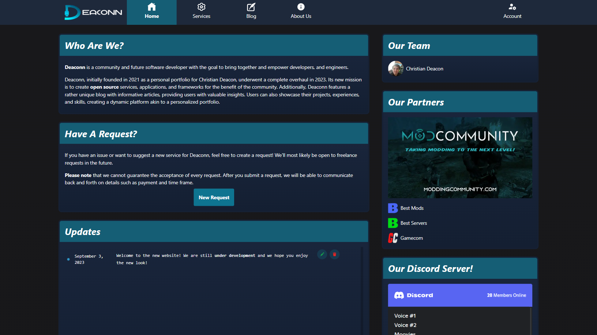
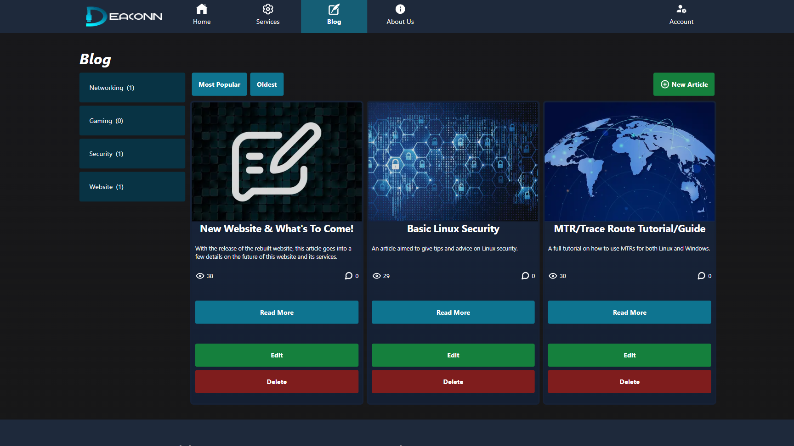
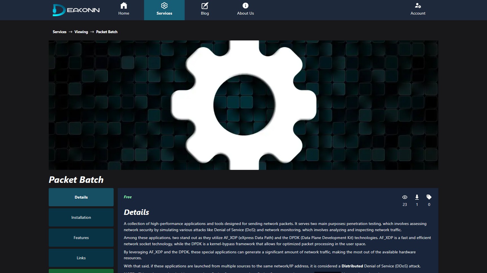

    

# Deaconn (New & Rebuilt)
This is Deaconn's rebuilt website which uses the T3 stack, [Create T3 App](https://create.t3.gg/). This stack comes with TypeScript, Next.js, React, tRPC, Prisma, and Tailwind CSS.

## Under Development!
This website is still under development and not yet public.

## Features
* Full Markdown support for anything that involves text content besides URLs and short text.
* Categories for blog and services.
* A custom blog.
* Services with a future transaction system.
* Submit requests for an existing service or request a new service to be made (free-lancing).
* User profiles including about me, experiences, projects, and skills. This will represent a resume.

## Preview (As Of August 8th, 2023)

## Credits
* [Christian Deacon](https://github.com/gamemann)