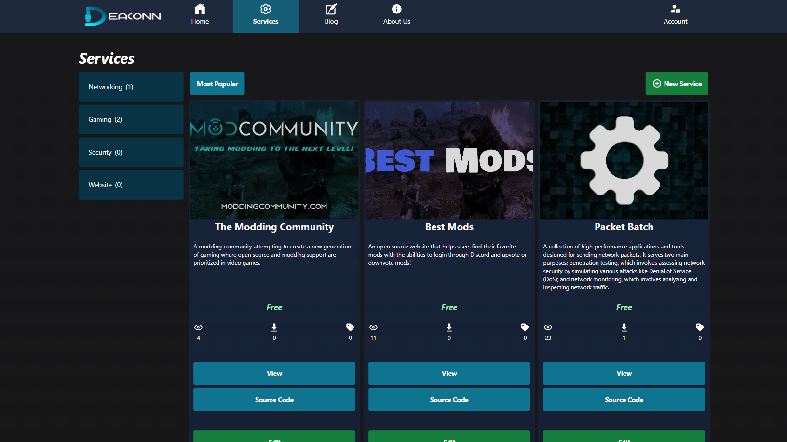
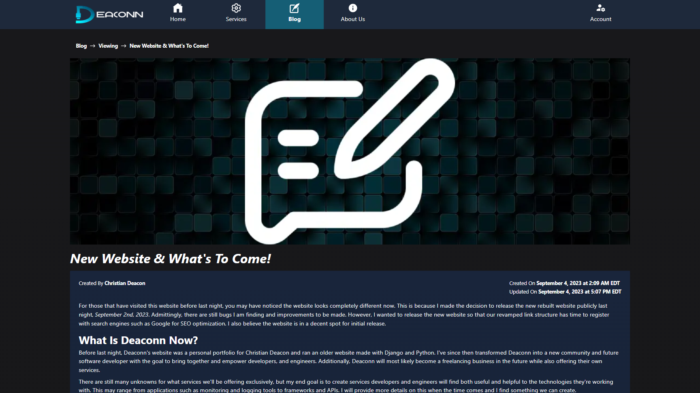
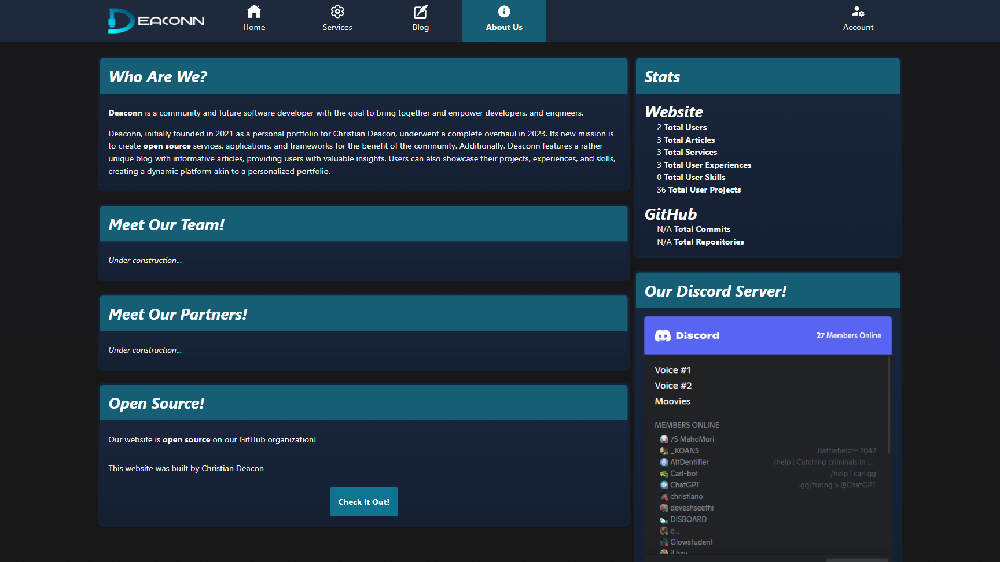
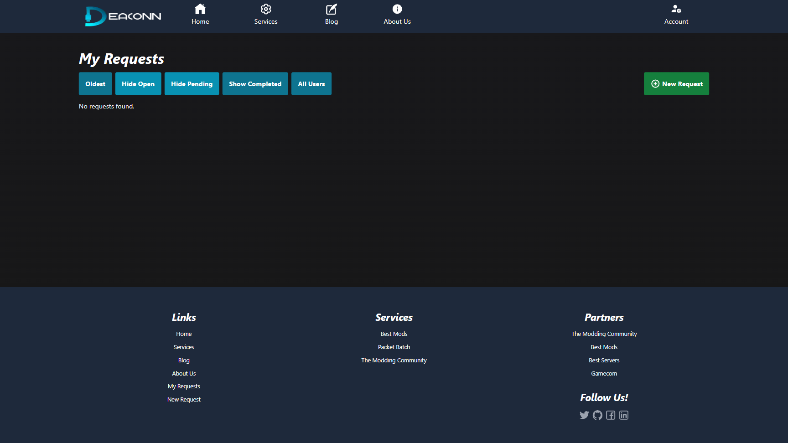
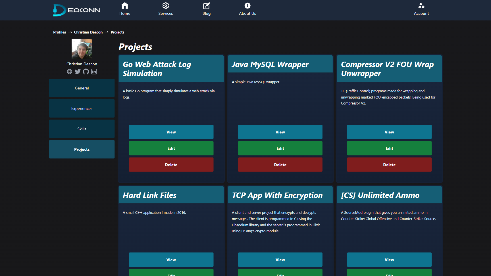

    

This is [Deaconn's](https://deaconn.net/) rebuilt website which uses the T3 stack, [Create T3 App](https://create.t3.gg/), and is completely **open source**! This stack comes with TypeScript, Next.js, React, tRPC, Prisma, and Tailwind CSS.

## Under Development!
This website is still under development and **not yet public**. There is currently no ETA on when this website will be released publicly, but we're hoping to have it up by **mid-Fall of 2023**.

## Features
* Login through Discord.
* Role-based permissions.
* A simple admin panel.
* Full Markdown support with code highlighting for content fields.
* A blog system.
* A service system which will eventually support transactions and more in the future.
* A request system
* User profiles including about me, experiences, projects, and skills that act as a resume.
* A Sitemap that generates URLs to static and dynamic content that should come up on search engines.

**Note** - We are adding additional features quite often since the website is actively under development.

## Contributing
If you'd like to contribute to this project, please contact [Christian Deacon](https://github.com/gamemann) by [email](mailto://christianmdeacon@gmail.com).

## Credits
* [Christian Deacon](https://github.com/gamemann) - Wrote all code
* [Cally](https://github.com/CallyPalladin) - Designed Deaconn's logo and icon

## Preview (As Of August 21st, 2023)

